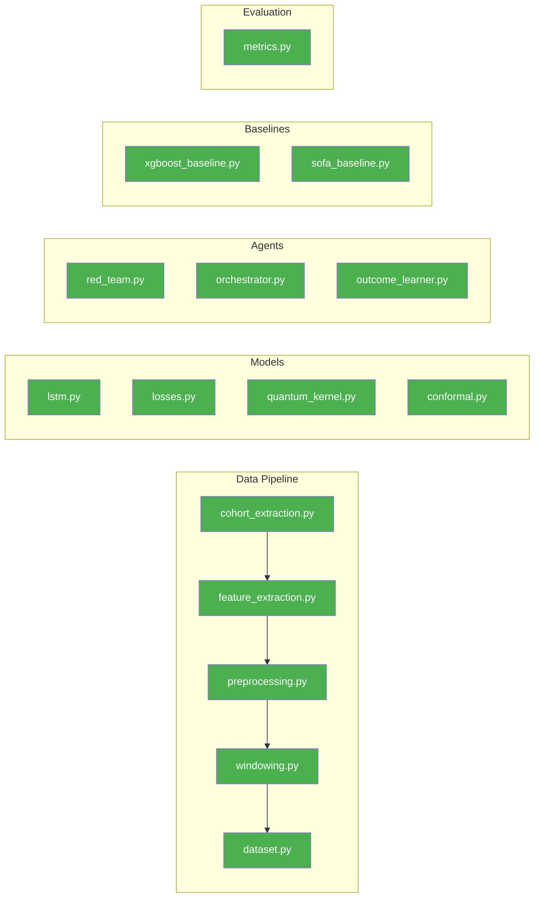
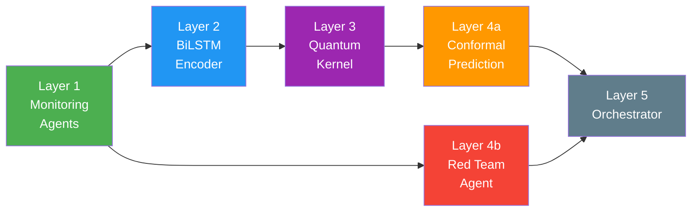
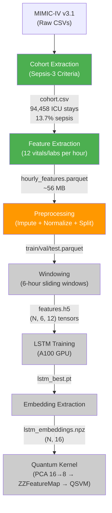
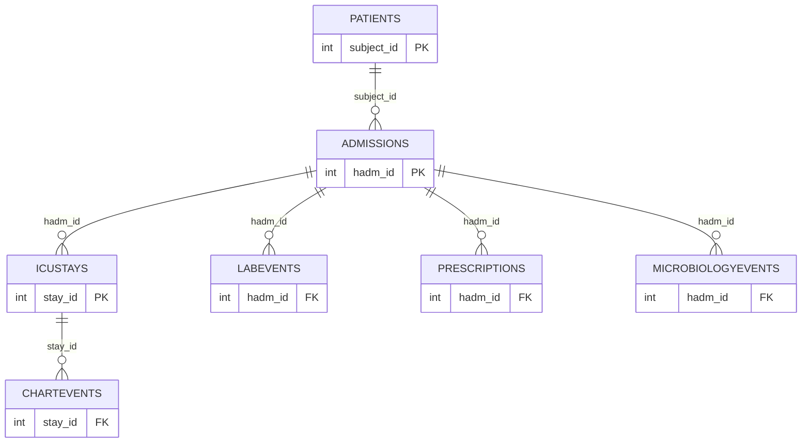

# QuantumSepsis Shield — Progress Report & Teammate Handoff

> **Project:** Adversarially-Safe Quantum-Classical System for Early Sepsis Detection  
> **Team:** Yash Gautam (YG), Atul Kumar Mishra (AKM), Tanishk Viraj Bhanage (TVB)  
> **Last Updated:** April 23, 2026 (with real MIMIC-IV results)

---

## ⚡ Quick Summary (TL;DR)

- **All code is written** — 24 Python modules, ~5,400+ lines across data pipeline, models, agents, baselines, evaluation
- **MIMIC-IV v3.1 downloaded** (9.9 GB) and **cohort extracted** (94,458 ICU stays, 12,972 sepsis = 13.7%)
- **Full Phase 1 pipeline completed on GPU server** — cohort → features → preprocessing → windowing → LSTM training → baselines
- **Real results obtained:** LSTM test AUROC = 0.7891, XGBoost test AUROC = 0.8038, SOFA test AUROC = 0.5869
- **Next:** Phase 2 — Quantum kernel integration using extracted LSTM embeddings

---

## 1. What Has Been Done ✅

### 1.1 Infrastructure Setup
| Task | Status | Details |
|------|--------|---------|
| GitHub repo created | ✅ Done | https://github.com/Mish-atul/QuantumSepsis |
| GPU server access | ✅ Done | `ssh csegpuserver@172.16.18.2` (password: `Redhat#84@`) |
| GPU verification | ✅ Done | 2× NVIDIA A100-PCIE-40GB, CUDA 13.0 |
| Python environment | ✅ Done | PyTorch 2.11.0+cu130, all deps installed via `pip3 install --user` |
| MIMIC-IV v3.1 download | ✅ Done | 9.9 GB at `~/QuantumSepsis/data/raw/physionet.org/files/mimiciv/3.1/` |

### 1.2 Code Implementation (ALL COMPLETE)



> **All 24 Python modules are fully implemented and tested with synthetic data.**

### 1.3 Real Data Processing (ON MIMIC-IV)

| Stage | Status | Output File | Details |
|-------|--------|-------------|---------|
| Cohort Extraction | ✅ **DONE** | `data/processed/cohort.csv` | 94,458 ICU stays, 12,972 sepsis (13.7%) |
| Feature Extraction | ✅ **DONE** | `data/processed/hourly_features.parquet` | 12 features × hourly, ~56 MB |
| Preprocessing | ✅ **DONE** | `data/processed/{train,val,test}_features.parquet` | Imputation + normalization + split |
| Windowing | ✅ **DONE** | `data/processed/features.h5` | 6-hour sliding windows → HDF5 (~4.09M train windows) |
| LSTM Training | ✅ **DONE** | `checkpoints/lstm_best.pt` | BiLSTM on A100, val AUROC = 0.7601 |
| Embedding Extraction | ✅ **DONE** | `data/processed/lstm_embeddings.npz` | 16-dim embeddings for quantum kernel |
| Baselines | ✅ **DONE** | `data/processed/pipeline_results_real.json` | XGBoost + SOFA comparisons |

### 1.4 Real Data Results — Phase 1 Metrics

| Model | Val AUROC | Test AUROC | Test AUPRC | Sensitivity@95%Spec |
|-------|-----------|-----------|------------|---------------------|
| **LSTM** | **0.7601** | **0.7891** | **0.0519** | **0.2997** |
| **XGBoost** | — | **0.8038** | **0.0576** | — |
| **SOFA Threshold** | — | **0.5869** | **0.0159** | — |

> ⚠️ **Note on low AUPRC:** The windowed data has high class imbalance (~4.09M windows but low positive rate). This is expected for sliding-window approaches on per-hour prediction. The AUROC numbers are reasonable for Sepsis-3 prediction.

### 1.4 Technical Challenges Solved

**Problem: Out-of-Memory (OOM) Crash**
- `labevents` (124M rows) and `chartevents` (330M rows) crashed when loaded fully into RAM
- **Solution:** Created `cohort_extraction_optimized.py` with chunked CSV reading (500K rows/chunk, filter inline)
- Memory usage: 30 GB → 2-3 GB

**Problem: NaN Timestamp Crash**
- Feature extraction crashed on ICU stays with missing `intime`/`outtime`
- **Solution:** Added guard to skip stays with invalid timestamps

---

## 2. System Architecture Overview

### 2.1 Five-Layer Pipeline



| Layer | Component | Input | Output |
|-------|-----------|-------|--------|
| 1 | Monitoring Agents | Raw vitals/labs | `(6, 12)` normalized window |
| 2 | BiLSTM Encoder | `(6, 12)` window | `(16,)` embedding + risk score |
| 3 | Quantum Kernel | `(16,)` → PCA → `(8,)` | Quantum risk score [0,1] |
| 4a | Conformal Prediction | Risk score | (score, lower, upper) at 90% coverage |
| 4b | Red Team Agent | Raw vitals window | Tripwire alerts (non-overridable) |
| 5 | Orchestrator | All above | GREEN/AMBER/RED/CRITICAL + actions |

### 2.2 Data Processing Flow



---

## 3. Dataset Details

### 3.1 MIMIC-IV v3.1

| Property | Value |
|----------|-------|
| Dataset | Medical Information Mart for Intensive Care IV |
| Version | 3.1 (Latest) |
| Source | PhysioNet, Beth Israel Deaconess Medical Center |
| Data Period | 2008–2022 (de-identified) |
| Total Patients | 364,627 |
| Hospitalizations | 546,028 |
| **ICU Stays** | **94,458** |
| Download Size | ~9.9 GB compressed |

### 3.2 Tables Processed



| Table | Rows | Our Usage |
|-------|------|-----------|
| patients | 364,627 | Demographics |
| admissions | 546,028 | Death timestamps |
| icustays | 94,458 | ICU stay boundaries |
| prescriptions | ~17M | Antibiotic orders → suspected infection |
| microbiologyevents | ~600K | Cultures → suspected infection |
| **labevents** | **~124M** | Lactate, WBC, Creatinine, Platelets |
| **chartevents** | **~330M** | HR, BP, Temp, SpO2, RR, GCS |

### 3.3 Cohort Statistics (Verified)

| Metric | Value |
|--------|-------|
| Total ICU stays | 94,458 |
| Sepsis-3 positive | 12,972 (13.7%) |
| Sepsis-3 negative | 81,486 (86.3%) |

### 3.4 12 Input Features

| # | Feature | Source | Item IDs | Unit |
|---|---------|--------|----------|------|
| 1 | Heart Rate | chartevents | 211, 220045 | bpm |
| 2 | SBP | chartevents | 51, 442, 455, 6701, 220179, 220050 | mmHg |
| 3 | DBP | chartevents | 8368, 8440, 8441, 8555, 220180, 220051 | mmHg |
| 4 | MAP | chartevents | 52, 456, 6702, 220052, 220181 | mmHg |
| 5 | Temperature | chartevents | 223762, 226329 | °C |
| 6 | Resp Rate | chartevents | 615, 618, 220210, 224690 | br/min |
| 7 | SpO2 | chartevents | 646, 220277 | % |
| 8 | GCS Total | chartevents | 198, 226755, 227013 | score |
| 9 | Lactate | labevents | 50813 | mmol/L |
| 10 | WBC | labevents | 51301 | K/uL |
| 11 | Creatinine | labevents | 50912 | mg/dL |
| 12 | Platelets | labevents | 51265 | K/uL |

---

## 4. Model Architecture

### 4.1 LSTM Encoder

```
Input: (batch, 6, 12)
  → LayerNorm([6, 12])
  → BiLSTM(input=12, hidden=128, layers=2, dropout=0.3)  → (batch, 6, 256)
  → TemporalAttention(256, attn_dim=64)                   → (batch, 256)
  → FC(256 → 64, ReLU, Dropout)
  → FC(64 → 16, Tanh)                                     → embedding (batch, 16)
  → FC(16 → 1, Sigmoid)                                   → risk_score (batch,)
```

**Parameters:** ~420K | **Loss:** Asymmetric Focal Loss (FN ≈ 9× FP penalty)

### 4.2 Quantum Kernel

| Parameter | Value |
|-----------|-------|
| Qubits | 8 (PCA-reduced from 16) |
| Feature Map | ZZFeatureMap |
| Entanglement | Linear |
| Repetitions | 2 |
| Backend | Qiskit AerSimulator (1024 shots) |

### 4.3 Three Novel Contributions

| # | Name | Innovation |
|---|------|------------|
| N1 | **QCCP** | Conformal prediction with quantum kernel nonconformity scores |
| N2 | **Adversarial Safety** | Red Team tripwires + adaptive loss from safety violations |
| N3 | **Confidence-Gated Fast-Tracking** | Skip preliminary diagnostics when confidence is high |

---

## 5. GPU Server Reference

| Item | Value |
|------|-------|
| **SSH** | `ssh csegpuserver@172.16.18.2` |
| **Password** | Ask team members (not stored in repo) |
| **GPUs** | GPU 0: A100-40GB ✅, GPU 1: T400-2GB ❌, GPU 2: A100-40GB ✅ |
| **CUDA** | 13.0 |
| **PyTorch** | 2.11.0+cu130 |
| **Python** | 3.10.12 (system, use `pip3 install --user`) |
| **Project Path** | `~/QuantumSepsis/` |
| **Data Path** | `~/QuantumSepsis/data/raw/physionet.org/files/mimiciv/3.1/` |
| **Always use** | `screen` sessions (VPN drops kill SSH) |
| **For training** | `CUDA_VISIBLE_DEVICES=0` or `=2` (skip GPU 1) |

---

## 6. 🚨 TEAMMATE: What You Need To Do Next

### Step 1: Verify pipeline artifacts exist

SSH into the server and check:

```bash
ssh csegpuserver@172.16.18.2
cd ~/QuantumSepsis

# All of these should exist:
ls -lh data/processed/cohort.csv
ls -lh data/processed/hourly_features.parquet
ls -lh data/processed/features.h5
ls -lh checkpoints/lstm_best.pt
ls -lh data/processed/lstm_embeddings.npz
ls -lh data/processed/pipeline_results_real.json

# View the metrics:
cat data/processed/pipeline_results_real.json
```

### Step 2: Current priority — Improve model performance

XGBoost (0.8038) is currently beating LSTM (0.7891) on test AUROC. Options:

**a) Hyperparameter tuning for LSTM:**
```bash
# Try with higher learning rate or different architecture
CUDA_VISIBLE_DEVICES=0 python3 -m src.training.train_lstm --data data/processed/features.h5
```

**b) Check class imbalance in windows:**
```python
import h5py
with h5py.File('data/processed/features.h5', 'r') as f:
    for split in ['train', 'val', 'test']:
        y = f[f'y_{split}'][:]
        print(f"{split}: total={len(y)}, pos={y.sum()}, rate={y.mean():.4f}")
```

### Step 3: Quantum Kernel Integration (Phase 2)

> ⚠️ **IMPORTANT:** The current `quantum_kernel.py` cannot run on ~4.09M training windows. A precomputed kernel matrix would be 4M × 4M = 16 trillion entries. **You must subsample.**

**Approach: Subsample for kernel computation**
```python
import numpy as np

# Load embeddings
data = np.load('data/processed/lstm_embeddings.npz')
X_train, y_train = data['X_train'], data['y_train']

# Subsample to ~2000-5000 samples (balanced)
from sklearn.utils import resample
pos_idx = np.where(y_train == 1)[0]
neg_idx = np.where(y_train == 0)[0]
n_sample = min(2500, len(pos_idx))
pos_sample = resample(pos_idx, n_samples=n_sample, random_state=42)
neg_sample = resample(neg_idx, n_samples=n_sample, random_state=42)
idx = np.concatenate([pos_sample, neg_sample])
X_sub, y_sub = X_train[idx], y_train[idx]

# PCA 16 → 8, then quantum kernel
from sklearn.decomposition import PCA
pca = PCA(n_components=8)
X_pca = pca.fit_transform(X_sub)

# Now run quantum kernel on X_pca (5000 × 8 matrix — feasible)
```

The quantum kernel module needs to be refactored to handle this subsampling approach. It should:
1. Load embeddings from `lstm_embeddings.npz`
2. Subsample to ~2000-5000 balanced samples
3. PCA 16 → 8 dimensions
4. Compute kernel matrix K(x,y) = |⟨Φ(x)|Φ(y)⟩|²
5. Train QSVM on the subsampled data
6. Evaluate on full test set using precomputed kernel rows

### Step 4: Record final metrics

After quantum kernel runs, collect and report:

| Model | Test AUROC | Test AUPRC | Sensitivity@95%Spec |
|-------|-----------|------------|---------------------|
| SOFA Threshold | 0.5869 | 0.0159 | — |
| XGBoost | 0.8038 | 0.0576 | — |
| Classical LSTM | 0.7891 | 0.0519 | 0.2997 |
| **QuantumSepsis Shield** | **TBD** | **TBD** | **TBD** |

---

## 7. Codebase Structure

```
QuantumSepsis/
├── src/
│   ├── config.py                           # All hyperparameters
│   ├── data/
│   │   ├── cohort_extraction.py            # Original (OOM on real data)
│   │   ├── cohort_extraction_optimized.py  # ✅ Memory-safe version
│   │   ├── feature_extraction.py           # ✅ 12 features/hour
│   │   ├── preprocessing.py                # ✅ Impute + normalize + split
│   │   ├── windowing.py                    # ✅ 6h windows → HDF5
│   │   └── dataset.py                      # ✅ PyTorch DataLoaders
│   ├── models/
│   │   ├── lstm.py                         # ✅ BiLSTM + Temporal Attention
│   │   ├── losses.py                       # ✅ Asymmetric Focal Loss
│   │   ├── quantum_kernel.py               # ✅ ZZFeatureMap + QSVM
│   │   └── conformal.py                    # ✅ Split Conformal + QCCP
│   ├── training/
│   │   └── train_lstm.py                   # ✅ Full training pipeline
│   ├── agents/
│   │   ├── red_team.py                     # ✅ Clinical tripwires
│   │   ├── orchestrator.py                 # ✅ Decision fusion
│   │   └── outcome_learner.py              # ✅ Adaptive thresholds
│   ├── baselines/
│   │   ├── xgboost_baseline.py             # ✅ XGBoost comparison
│   │   └── sofa_baseline.py                # ✅ SOFA threshold
│   └── evaluation/
│       └── metrics.py                      # ✅ AUROC, AUPRC, etc.
├── scripts/
│   ├── run_windowing_real.py               # ✅ Real-data windowing runner
│   ├── run_real_baselines.py               # ✅ Metric comparison script
│   └── run_pipeline_autonomous.sh          # ✅ Auto pipeline orchestrator
├── files/
│   ├── architecture.md                     # Full 5-layer spec
│   ├── dataset.md                          # MIMIC-IV reference
│   ├── novelty.md                          # 3 novelty claims
│   ├── baseline_comparison.md              # Comparison plan
│   └── roadmap.md                          # 12-week roadmap
├── IMPLEMENTATION_PLAN.md                  # Detailed execution plan
├── PROGRESS_REPORT.md                      # This file
├── README.md                               # Project overview
└── requirements.txt                        # Python dependencies
```

---

## 8. References

1. Singer et al. (2016). Sepsis-3 Definitions. *JAMA* 315(8):801-810.
2. Kumar et al. (2006). Duration of hypotension in septic shock. *Crit Care Med* 34(6):1589-96.
3. Havlíček et al. (2019). Quantum-enhanced feature spaces. *Nature* 567:209-212.
4. Schuld & Killoran (2019). Quantum ML in Feature Hilbert Spaces. *PRL* 122:040504.
5. Vovk et al. (2005). *Algorithmic Learning in a Random World.* Springer.
6. Lin et al. (2017). Focal Loss. *ICCV 2017*.
7. Johnson et al. (2023). MIMIC-IV. *PhysioNet*. DOI: 10.13026/6mm1-ek67.
